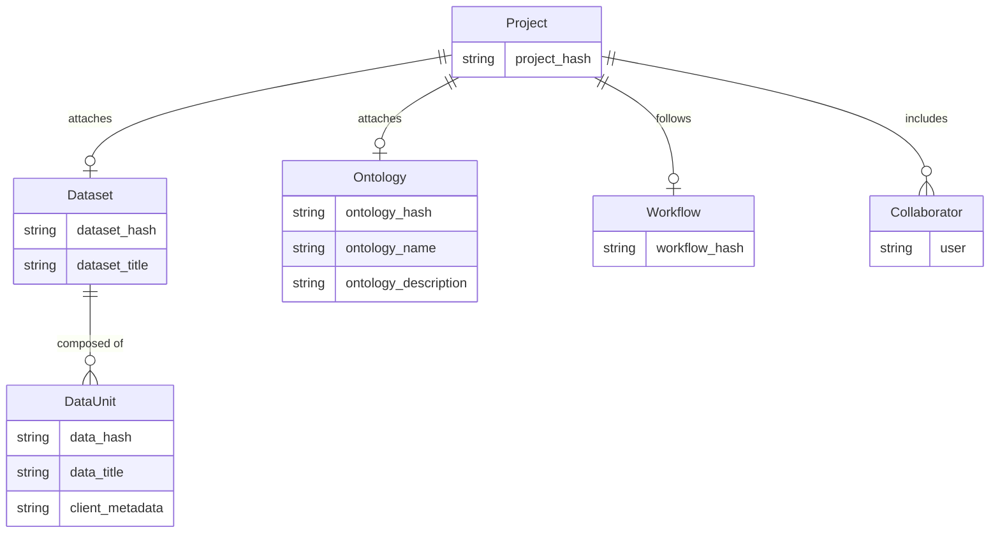

<Note>Data added prior to the release of _Index_ is stored in Mirrored Datasets. Learn more about Mirrored Datasets [here](/platform-documentation/Annotate/annotate-datasets/annotate-datasets#mirrored-datasets).</Note>

Datasets are subsets of your files that can be attached to one or more Projects for annotation. Datasets are created from files you upload to Encord.

## Creating Datasets

1. Click the **New dataset** button in the _Datasets_ section in _Annotate_.

    

2. Give your Dataset a meaningful title and description. A clear title and description keeps your data organized.

<Tip>Toggle **Looking to create a mirrored dataset?** to create a [Mirrored Dataset](/platform-documentation/Annotate/annotate-datasets/annotate-datasets#mirrored-datasets). </Tip>

    

3. Click **Create dataset** to create the Dataset. 

## Attach Data

After a Dataset has been created, you can attach data.

<Tip>[You can add data to Datasets from the _Files_ or the _Datasets_ screens](/platform-documentation/Index/index-files#add-data-to-datasets).</Tip>

<Tip>
To ensure smoother uploads and faster completion times, and avoid hitting absolute file limits, we recommend adding smaller batches of data. Limit uploads to 100 videos or up to 1,000 images at a time. You can also create multiple Datasets, all of which can be linked to a single Project. Familiarize yourself with our [limits and best practices for data import and registration](/platform-documentation/General/best-practices#import-into-encord) before adding data to Encord. 
</Tip>

1. Navigate to the _Datasets_ section under the _Annotate_ heading.
2. Click the Dataset you want to add data to. 
3. Click **+Attach existing files**. 

<Tip>If the files you want have not been uploaded into Encord yet, click **+Upload files** to [add new files](/platform-documentation/Index/index-files#upload-files-to-a-folder).</Tip>

    

4. Select the folders containing the files you want to attach to the Dataset. To select individual files, double-click a folder to see its contents, and select the files you want to add to the Dataset. 

5. Click **Attach data** to attach the selected files to the Dataset.

---

## Register Cloud Data to Datasets

<Tip>We recommend registering files in batches not exceeding 2GB, to ensure upload does not exceed 3 hours.</Tip>

1. [Create a Dataset](/platform-documentation/Annotate/annotate-datasets/annotate-datasets#creating-datasets). 

2. Select the Dataset you want to add data to. 

3. Click **+Upload files**.

    

4. Select a folder to store the files in, or create a new folder.

5. Select the _Import from private cloud_ tab and select the integration you want to use. 

    

6. Click **Add JSON or CSV files** to upload a [JSON](#json-format) or [CSV](#csv-format) file specifying the cloud data that is to be added to the Dataset. Turn on the **Ignore individual file errors** toggle to ignore errors caused by files not supported by Encord.

    

<Tip>We recommend enabling the **Ignore individual file errors** toggle. This ensures that the entire upload does not fail if only one file cannot be added.</Tip>

7. Click **Import** to add your cloud data to the Dataset. 

<Note>The data is be fetched from your cloud storage and processed asynchronously. This involves fetching appropriate metadata and other file information to help us render the files appropriately and to check for any framerate inconsistencies. We do not store your files in any way.</Note>

---

## Mirrored Datasets

Mirrored Datasets provide a continuity solution that retains the organization of data prior to the release of _Index_. With the transition to Index, all existing data within Datasets has been transferred to _Files_ in the form of Mirrored Datasets. Mirrored Datasets can be managed using both the Files and Datasets sections of the Encord platform.

For example, moving a file named "chicken.mp4" from a mirrored Dataset titled "Animal videos" to another mirrored Dataset called "Chicken videos", results in "chicken.mp4" being visible in all Projects associated with "Chicken videos". 

---

## Entity Relationships

The following diagram illustrates how Datasets relate to other entities in Encord.

The following diagram shows how entities in Encord are organized. 

- Projects bring together Ontologies, Datasets, Workflows, and collaborators.
- A Project can have multiple Datasets attached to it, but only one Ontology.
- One Ontology can be attached to multiple Projects. 

---

## Roles and Permissions

Collaborator permissions can be set in the [_Team_ section of the Dataset _Settings_](#team).

| Permission      | Admin | Viewer |
|-----------------|-------|--------|
| View dataset    | ✅     | ✅      |
| Add data        | ✅     | ❌      |
| Adjust settings | ✅     | ❌      |

---

## Manage Datasets

Use the _Datasets_ tab in the navigation bar to manage your Datasets.

    

Click a Dataset to: 
- Upload additional files to the Dataset.
- Remove files from the Dataset.
- Manage who has access to the Dataset.

The dashboard is split into two tabs:

- The [_Data_ tab](#data-tab).
- The [_Settings_ tab](#settings-tab).

    

***

### Data tab

Use the data tab to upload, and manage existing files.

    

- **A** - Click and select (or drag-and-drop) files into the area highlighted below to add files to a Dataset. 

- **B** - Manage files contained in the Dataset.

  - Edit the filename by clicking the _Edit_ icon.
  - Select a file by clicking the checkbox next to the file name.
  - Select a file and click the _Delete_ button to delete the file from a Dataset.
  - [Re-encode](/platform-documentation/General/general-supported-data#re-encode-your-data) a file by selecting the file and clicking the **Re-encode(auto)** button.

***

### Settings Tab

#### Team

The _Team_ pane shows a list of collaborators on the Dataset.

- Invite collaborators by clicking the **+ Invite collaborators** button and adding their emails. 
- New collaborators are assigned the 'Viewer' role by default. A 'Viewer' cannot make changes to the Dataset, only an 'Admin' can.
- Collaborators can be upgraded to 'Admin' using the 3 dots to the right of their name. 
- Click the _Delete_ icon to delete a collaborator.

<Note>An 'Admin' cannot be reverted to a 'Viewer'. To do so you must delete and re-invite the user.</Note>

#### Linked Projects

The _Projects_ pane shows a list of Projects using the Dataset.

Click on **View** to navigate to that Project.

---

### Danger Zone (Delete Datasets)

Use the _Danger zone_ pane to delete Datasets.

Click the **Delete dataset** button to delete the entire Dataset. You are prompted to type the word 'delete' into the resulting pop-up to delete the Dataset.

<Warning>Deleting a Dataset cannot be undone. Make sure you want to perform this action before continuing.</Warning>

---

## Joining Datasets in your Org

Organization Admins can search for and join any Datasets that exist within the Organization.

1. Navigate to _Datasets_ under the _Annotate_ heading in the Encord platform. 
2. Select the _All Encord datasets_ tab. 
3. Find the Dataset you want to join.
4. Click **Join dataset** to join the Dataset.

    

When an Organization Admin joins a Dataset, they are automatically assigned the _Admin_ [user role for that Dataset](/platform-documentation/Annotate/annotate-datasets/annotate-datasets#roles-and-permissions).

<Tip>Datasets can be filtered by Dataset owner.</Tip>

<Tip>See all Datasets you belong to by clicking the _Filter by_ search bar, and selecting  _My datasets only_. </Tip>